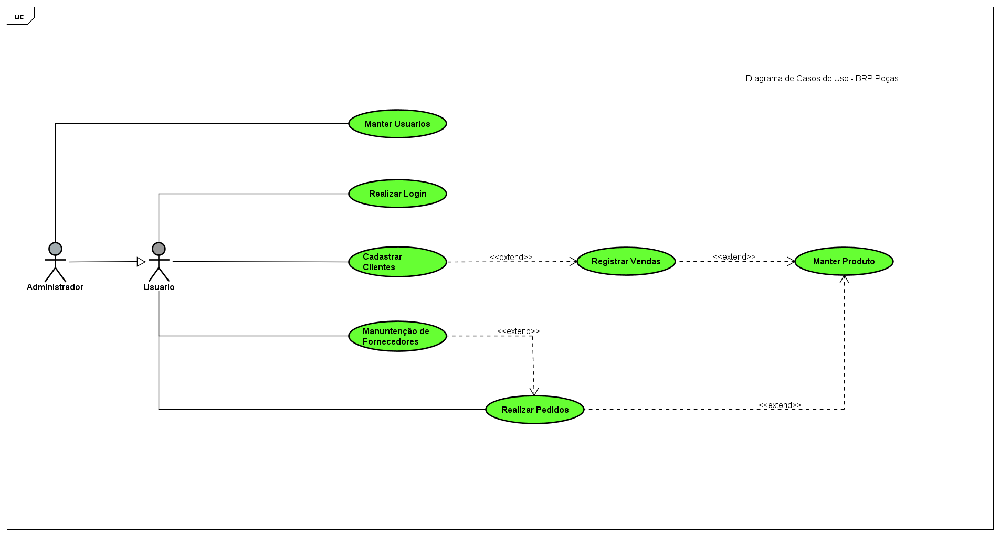
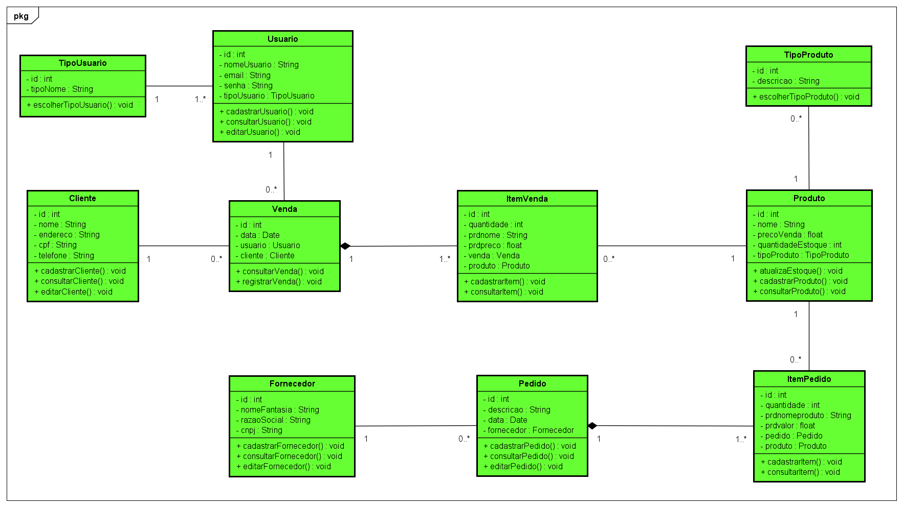

# BRP-Pecas

O software BRP - Pecas tem por objetivo gerenciar uma loja de autopecas, ou seja, nada mais é que um sistema que irá facilitar o controle de gastos e estoque de uma loja. Fazendo para isso, a manuntenção de funcionários e seus respectivos clientes, determinando valores referentes a cada produto e cada pedido efetuado para o fornecimento, retendo um valor total para cada venda. 
A finalidade desse software é armazenar diversos tipos de dados com segurança com fácil manuseio e levando uma economia de tempo junto a diminuição de erros humanos.

## Diagrama de Casos de Uso

## Diagrama de Classes

